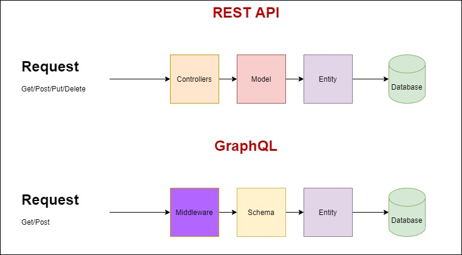

# DotNetCore.Api.GraphQL
**What is GraphQL**

GaphQL is open source specification by Facebook to data query and manipulation for APIs.

It is faster by optimising your request query, it solves the problem of over-fetching. It brings some drawbacks as well for example, implementing caching is complicated.

The difference between Rest API and GraphQL API can be elaborated as below:
  
  

It has no models but the schema. The schema handles the data operations using the data layer. There is no need for controllers,but middleware can be used to serve the request.

## GraphQL Example

**Query 1:**

    {
      todotasks
      	{ 
          id,title,description,
          cost,status
        }  
    }
**Query 2: With parameter**

     query taskById($taskId:ID!)
      {   todotask(id:$taskId)  
           { 
                 id,title,description
  	             feedbacks {id, comment}
         }  
     }

## How to run the code
Create a database in SQL Server and modify the connection string accordingly.

    "ConnectionStrings": {
        "TodoDb": "Server=<your-sql-server>;Database=TodoTask;Trusted_Connection=True;MultipleActiveResultSets=true"
      }
Go to Package Manager Console and run the below commands:
```
    Add-Migration InitialCreate

    Update-Database
```
Add some sample data and run the application.

